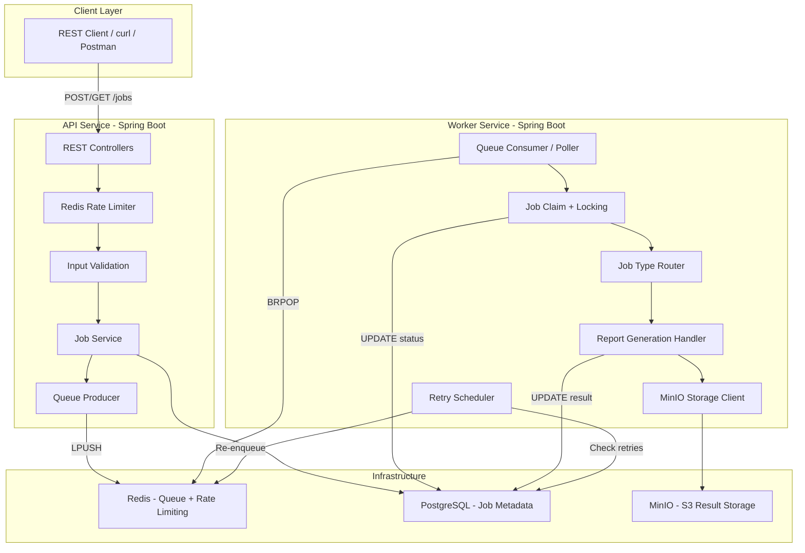

# TaskQueueX

A distributed background job processing platform built with Java 21, Spring Boot 3.x, PostgreSQL, Redis, and MinIO. This project demonstrates production-ready backend engineering practices including asynchronous processing, queue-based architecture, worker orchestration, retry mechanisms, and cloud-style storage patterns.

## Architecture



## Features

- **REST API** for job submission and management
- **Redis-based queue** for asynchronous job processing
- **Worker service** with horizontal scaling support
- **PostgreSQL** for job metadata and status tracking
- **MinIO** for S3-compatible object storage of job results
- **Retry mechanism** with exponential backoff
- **Rate limiting** on job submission endpoints
- **Idempotency** support via idempotency keys
- **Job status tracking** with full attempt history
- **Observability** with Micrometer metrics, correlation IDs, and structured logging
- **OpenAPI/Swagger** documentation

## Tech Stack

- **Java 21**
- **Spring Boot 3.3.0**
- **Spring Data JPA**
- **PostgreSQL 16**
- **Redis 7**
- **MinIO** (S3-compatible storage)
- **Flyway** (database migrations)
- **Docker & Docker Compose**
- **Testcontainers** (integration testing)
- **Micrometer** (metrics)
- **Swagger/OpenAPI**

## Quick Start

### Prerequisites

- Docker and Docker Compose
- Java 21 (for local development)
- Maven 3.9+ (for local development)

### Running with Docker Compose

1. Clone the repository:
```bash
git clone <repository-url>
cd taskqueueX
```

2. Copy the environment file:
```bash
cp env.example .env
```

3. Start all services:
```bash
docker-compose up -d
```

This will start:
- PostgreSQL on port 5432
- Redis on port 6379
- MinIO on ports 9000 (API) and 9001 (Console)
- API service on port 8080
- Worker service (scalable)

4. Access services:
- API: http://localhost:8080
- Swagger UI: http://localhost:8080/swagger-ui.html
- MinIO Console: http://localhost:9001 (minioadmin/minioadmin)

5. Scale workers (optional):
```bash
docker-compose up -d --scale worker=3
```

### Local Development

1. Start infrastructure services:
```bash
docker-compose up -d postgres redis minio
```

2. Build the project:
```bash
mvn clean install
```

3. Run the API service:
```bash
cd taskqueuex-api
mvn spring-boot:run
```

4. Run the Worker service (in another terminal):
```bash
cd taskqueuex-worker
mvn spring-boot:run
```

## API Endpoints

### Submit a Job

```bash
curl -X POST http://localhost:8080/jobs \
  -H "Content-Type: application/json" \
  -d '{
    "jobType": "REPORT_GENERATION",
    "payload": "{\"title\":\"Sales Report\",\"data\":[{\"product\":\"Widget\",\"sales\":1000},{\"product\":\"Gadget\",\"sales\":2000}]}",
    "priority": 0,
    "maxRetries": 3,
    "idempotencyKey": "unique-key-123"
  }'
```

### Get Job Status

```bash
curl http://localhost:8080/jobs/{job-id}
```

### List Jobs

```bash
curl "http://localhost:8080/jobs?status=QUEUED&page=0&size=20"
```

### Retry a Failed Job

```bash
curl -X POST http://localhost:8080/jobs/{job-id}/retry
```

### Cancel a Job

```bash
curl -X POST http://localhost:8080/jobs/{job-id}/cancel
```

### Health Check

```bash
curl http://localhost:8080/health
```

### Metrics

```bash
curl http://localhost:8080/actuator/metrics
```

## Job Types

### REPORT_GENERATION

Generates a CSV report from JSON data and uploads it to MinIO.

**Payload format:**
```json
{
  "title": "Report Title",
  "data": [
    {"column1": "value1", "column2": "value2"},
    {"column1": "value3", "column2": "value4"}
  ]
}
```

## Job Statuses

- **QUEUED**: Job is in the queue waiting to be processed
- **IN_PROGRESS**: Job is currently being processed by a worker
- **SUCCEEDED**: Job completed successfully
- **FAILED**: Job failed (may be retried)
- **RETRY_SCHEDULED**: Job is scheduled for retry
- **DEAD_LETTER**: Job exceeded max retries and will not be retried
- **CANCELLED**: Job was cancelled by user

## Design Decisions

### Multi-Module Maven Structure

The project uses a Maven multi-module layout:
- `taskqueuex-common`: Shared entities, enums, repositories
- `taskqueuex-migrations`: Flyway database migrations
- `taskqueuex-api`: REST API Spring Boot application
- `taskqueuex-worker`: Worker Spring Boot application

This allows API and Worker to be deployed separately while sharing common code.

### Redis BRPOP for Queue Consumption

Uses Redis `BRPOP` (blocking right pop) for simple, efficient queue consumption. Workers naturally distribute work without complex coordination.

### Optimistic Locking

Jobs use JPA `@Version` for optimistic locking to prevent double-claiming. Workers atomically update job status with version check.

### Exponential Backoff Retry

Retries use exponential backoff: `baseDelay * 2^retryCount` with jitter to prevent thundering herd.

### Sliding Window Rate Limiting

Rate limiting uses Redis counters with TTL for a simple sliding window implementation.

## Project Structure

```
taskqueueX/
├── docker-compose.yml          # Infrastructure orchestration
├── Dockerfile                   # Multi-stage build for API/Worker
├── pom.xml                      # Parent POM
├── taskqueuex-common/           # Shared module
├── taskqueuex-migrations/       # Database migrations
├── taskqueuex-api/              # API service
└── taskqueuex-worker/          # Worker service
```

## Testing

Run all tests:
```bash
mvn test
```

Run integration tests:
```bash
mvn test -Dtest=*IntegrationTest
```

## Monitoring

- **Metrics**: Available at `/actuator/metrics` and `/actuator/prometheus`
- **Health**: Available at `/actuator/health`
- **Logs**: Structured logging with correlation IDs

## Future Improvements

- [ ] Support for additional job types (image processing, webhook dispatch, etc.)
- [ ] Priority queues with multiple Redis lists
- [ ] Job scheduling (cron-like functionality)
- [ ] Webhook notifications on job completion
- [ ] Kafka integration as alternative to Redis
- [ ] Job result streaming for large outputs
- [ ] Advanced filtering and search
- [ ] Job dependencies and workflows
- [ ] Distributed tracing with OpenTelemetry
- [ ] Kubernetes deployment manifests

## License

This project is open source and available under the MIT License.

## Contributing

Contributions are welcome! Please feel free to submit a Pull Request.
